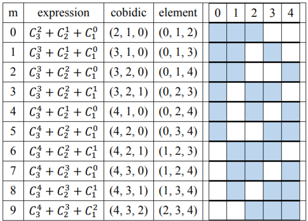
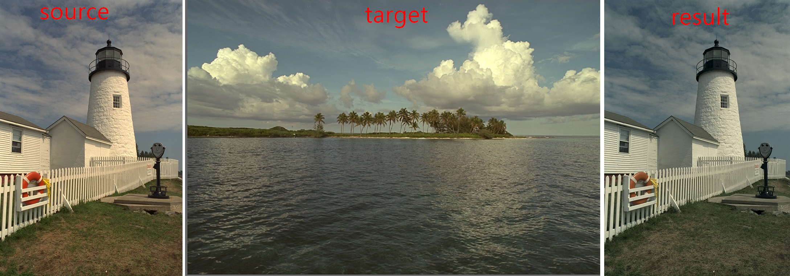

# Color science NCHU

## HW1

> Input: n, k, m
>
> n decided the domain [0, n)
>
> k decided the length of tuple
>
> m is the m-th cobidic tuple
>
> n = 5, k = 3
>
> 
> 

## HW2

HW2 is similar to HW1, but return the m-th element tuple

## HW3 - color transfer

HW3 is a program modified from [https://github.com/jrosebr1/color_transfer](https://github.com/jrosebr1/color_transfer)

The most different from our version to original version is the *source* paramater and the *target* paramater. The original version will change the *target* image according to the *source* image. However, we change the *source* image according to the *source* image.

## HW4
Modify Assignment 3 to produce decimal side
information. The decimal side information is a text file entitled "sideinfodeci.txt". This text file has 12 lines and each line represent a decimal value with four decimal places

+ 1-3: Mean of the *source* image in the RGB (or LAB) channel
+ 4-6: Standard deviation of the *source* image in the RGB (or LAB) channel
+ 7-9: Mean of the *target* image in the RGB (or LAB) channel
+ 10-12: Standard deviation of the *target* image in the RGB (or LAB) channel

## HW5
Write a code to implement the reverse color transfer

+ input: the result image in HW3 and *sideinfodeci.txt* in HW4
    + soruce file: sou1.png
    + target file: tar1.png
    + color transfer file: utl1.png
    + side info: sideinfodeci.txt
+ output: recovered image *yrcsou.png*

## HW6

Proof an equation

## HW7

**4107056019-07-Bin2Dec**: Transfer float32 binary string to number 

**4107056019-07-Dec2Bin**: Transfer float32 number to binary string

## HW8

這作業有點難說明，反正就什麼遍歷性的，求 pull request 說明一下

然後那隻貓變綠綠的是正常的

## HW9

Logistic map

## HW10

Determining Secret Keys for 2D Arnold Cat Map